# Varna Eats - Restaurant

## Performance of the web page on different devices

[Click on this link to visit the site on Heroku](https://dinesdj-cb401df90931.herokuapp.com/)

# Content

## Table of Content 
1. [Wireframe](#wireframe)
2. [UX Description](#ux-description)
3. [Technologies used](#technologies-used)
4. [Website Features](#website-features)
5. [Features to implement](#other-features)
6. [Agile palnning](#agile-planning)
7. [Project structure](#project-structure)
8. [Testing and Validation](#testing-and-validation)
9. [Bugs and Issues](#bugs-and-issues)
10. [404 page](#notfound-page)
11. [Deployment](#deployment)
12. [Credits](#credits)

---

## [Wireframe](#wireframe)

Varna Eats is a web application that allows users to view the menu, make reservations, and manage tasks. This project is built using Django and is deployed on Heroku.

### Summary of the Schema Design
#### Menu Management:

The MenuItem model stores information about available dishes.

#### Task Management:

The Task model helps track important business tasks.

#### User Feedback System:

The Feedback model allows users to submit their opinions and suggestions.

#### User Management:

The built-in User model handles authentication and user data.

ferenced in the Feedback model.

#### MenuItem Model
Table Name: menu_menuitem

Fields:

id (Primary Key): Auto-generated unique identifier for each menu item.
name (CharField): The name of the dish (e.g., "Caesar Salad").
description (TextField): A detailed description of the dish.
price (DecimalField): The price of the dish, with up to 5 digits and 2 decimal places.
image (ImageField): Stores the file path of the uploaded image (e.g., via Cloudinary).
category (CharField): A predefined list of choices ('Main Course', 'Salad', 'Soup', 'Dessert').
Relationships:

No foreign key relationships, meaning it's an independent entity.
Purpose:
This model is used to store information about food items available on the restaurant's menu.

#### Task Model

Table Name: tasks_task

Fields:

id (Primary Key): Auto-generated unique identifier for each task.

task_name (CharField): A short descriptive title of the task.

task_description (TextField): A detailed description of the task.

due_date (DateField): The deadline for completing the task.

is_urgent (BooleanField): A flag to indicate whether the task is urgent or not (default is False).
Relationships:

No foreign key relationships; it operates independently.

Purpose:

This model is used to track and manage tasks related to the business operations, such as preparing orders, managing inventory, or administrative work.

#### Feedback Model

Table Name: feedback_feedback

Fields:

id (Primary Key): Auto-generated unique identifier for each feedback entry.

user (ForeignKey to auth_user): A relationship linking the feedback to a registered user. If the user is deleted, their feedback is removed as well (on_delete=models.CASCADE).

comment (TextField): Stores the feedback comment submitted by the user.

created_at (DateTimeField): Automatically stores the timestamp when feedback is created.

Relationships:

One-to-Many with User: Each user can provide multiple feedback entries, but each feedback is linked to one user.

Purpose:
This model stores user feedback, which can help improve the restaurant services by collecting customer opinions.

#### User Model (Django Built-in)

Table Name: auth_user (Django default)

Fields (key ones):

id (Primary Key): Unique identifier for each user.
username (CharField): The unique username for the user.
password (CharField): Hashed password for authentication.
email (EmailField): User's email address.
Relationships:

One-to-Many with Feedback: A user can submit multiple feedback entries.
Purpose:
Handles user authentication and management in the system.

Relationships Overview

One-to-Many (User -> Feedback):
Each user can submit multiple feedback comments.

Independent Models:

The MenuItem and Task models do not have relationships with other tables but are useful for managing the restaurant's menu and operational tasks separately.

---

## [UX Description](#ux-description)

This site was designed predominantly for restaurant owners, where they can present their restaurants, the menus, and where they can update the manues using postgres database, they can also add recepies, update recepies and delete recepies with using postgres as a database. Form the application menu, using databaase SQLLIte for development and PostgrsSql for production the owner or the manager of the restaurant can add menu items with photo, text and price. From tasks the manager can add, update tasks and delete tasks. The site has also a interactive javascript map facilitating the customers by showing the restaurant's whereabouts. 

The layout is kept pretty simple, with three pages describing the Bulgarian cuisine, the menu page and the contact page from where the customer can make reservations by filling and sending the form. At the far right is the login button from where the owner or the restaurant manager can log in to update, delete and add recepies of the menu page. From there he can also add tasks, update and delete tasks, helping the management to better organize his business.

---

## [Technologies used](#technologies-used)

- HTML5, Django templates. Used to structure my website. There is only one page base.html of this website  and using Django template mark up the rest of the pages extend the base.html

 Semantic element have been used like container, row, form, div.
 
  Responsive design was implemented by the code in the head with metatag defining the control of page's dimensions and scaling.

- CSS3, Bootstrap: Bootstrap container class provides a responsive fixed-width container.
 The row class is used to create a horizontal group of columns.Justify-content-center: This class centers the content horizontally within the row. col-sm-8: sets the width of the content to 8 columns out of a 12-column grid on small and larger devices, and you can adjust it as needed.
 btn-block used to buttons for full-width styling. button classes to btn-primary and btn-danger for better visual distinction.

 Responsive web design is used to resize, and shrink, the content to make it look good on any screen.  Box sizing border box was used to  padding and border of element's total width and height. Media query with breakpoint of 420px was used for the responsiveness of the page. Hover css was used on the nav bar onclicking the login, and also onclicking the buttons in the nav panel.

- JavaScript. Used to provide functionality to my website. Event listener used is to handle form submission and send the form data using EmailJS. Included the EmailJS SDK script in the contact.html file. Javascript was used to embed the google map. JavaScript function confirmDelete was used for the defensive design of the delete task. confirmDelete function is used from base.htm  confirmDeleteRecipe and confirmDeleteTask functions are defined and utilized within individual HTML templates.Onsubmit attribute in the delete form calls confirmDelete(event), which asks for confirmation before submitting the delete form. By clearly defining separate routes and ensuring the JavaScript functions are scoped to specific pages, I avoid collisions between the delete actions on different pages. This approach helps to ensure that both the delete functionality for recipes and tasks work independently without interfering with each other.

- Python3, Datetime, Django libraries are imported in the main python file, settings.py and also in views.py and models.py. SQLAlchemy is installed, PostgreSql is used for the menu database. Database models are defined for Cathegories and tasks.
The delete_task, add_task, update_task routes are used to correctly handle POST requests to delete, update and add a task and redirect back to the tasks list. Used url_for function to correctly points to the Django routes. Delete_task, update-task, and add_task routes accept the correct HTTP methods (GET, POST). Ensured Unique URLs for Delete Actions. Making sure the URLs for the delete actions in both update_menu.html and update_task.html are distinct. Handling POST Requests: The update_menu function is updated to load recipes at the beginning. If the request is a POST request and the form contains 'add', it adds the new recipe. If the form contains 'delete', it deletes the selected recipe and writes the updated list back to the database.

- Github - The cloud based service for hosting repositories for over 73 million developers
- Git - Used to add, commit and push my changes to the server and to create a repository with the help of The Code Institute template.
- Favicon.io - Used to source my favicon icons for my website.
- Google Fonts - Used to source different fonts in my css file. Google font were used Roboto.
- CoralDraw was used to illustrate this page with the flow chart's logic.
- This page was made with Visual Studio Code on gitpod.io, and for deploying the pages the 
git add . git commit and git push commands were used.
- Gitpod.io was used to work on the project.
- Heroku was used to deploy my site.
- Cloudinary was used to store the dynamic uploaded pictures.
- Whitenoise is used to handle tha static and pictures.
  
---

## [Website Features](#website-features)

- View the menu with various recepies.
- Make reservations through a contact form.
- Login and manage the menu (add, update, delete recipes).
- Task management functionality including adding, updating, and deleting tasks.
- Send email for reservations

---

## [Features to implement](#other-features)

Given more time to invest in the project, I would like to implement some more features: 

- The menu page except menues to have an option for online payment and booking, and also a delivery for home.
  
- The form from the contact page should have dropdown menu for date and time of the reservation, also dropdaown for the main course, starters, desserts, so that those booking for functions, celebrations, receptions and parties can fix their menu beforehand online.
- To fulfil authomatic testing. For now only manual testing is carried out.  
- This project can target restaurant owners and catering services.
- This project has a registration link from the login of the customers to be directed to the forum, blog application from where they can make comments of the service. This application will be built in the future.
- Enhancements of the view specific viewports for Add and Delete recepies.
- Progress bar: When uploading an image.
- Pagination: If the menu grows in size.
- Search/filter: For easier management of recipes.
  
 ---
 
## [Agile planning](#agile-planning)

Severel steps were taken into consideration to develop this project. **Requirements** were detailed, **analyses** performed to see what technologies might be used, the **design** was made using bootstrap and CSS combined the **development** was carried out on gitpod.io, **testing** was made only manually, the authomatic testing was abondened due to lack of time. **User stories** were found regarding the usage of the contact submit form, for phones, which are widely used for internet it is difficult, or almost impossible to put the phone numbers with hifens.
Several development cycles were followed **1st cycle iteration** creating the HTML and CSS structure. **2nd cycle iteration** implementing Django template language and Django. **3rd cycle iteration** creating the Postgres database with menu/views.py, menu/models.py  for the menues. **4th cycle iteration** Creating task application with SQLLite database for development and PostgresSql for production with models for categories and tasks. **5th cycle iteration** Creating the contact page with the submit form. Pure python project was abandoned as too complex and unfeasible, in terms of user and password requirements. Implemented the technology ofEmailjs.com for the form submission.

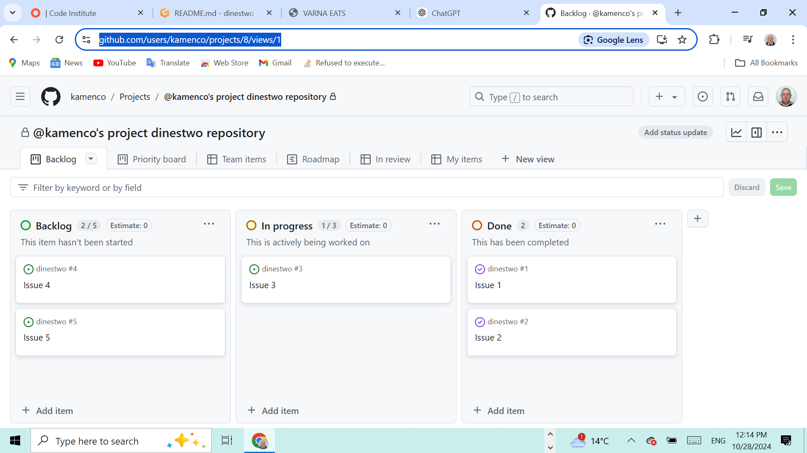
The Agile tool used for this project is Git Project.

[This is the link to Kanban board on github](https://github.com/users/kamenco/projects/8/views/1)

---

 ## [Project structure](#project-structure)

    |-- DINESTWO
      |-- accounts/
        |--templates/
          |--login.html
          |--logout.html
          |--registration.html
      |-- contact/
        |--templates
          |--contact.html
      |-- dines/
        |--settings.py
        |--urls.py
      |-- home/
        |-- templates/
          |-- index.html
        |-- url.py
        |-- views.py
      |-- media/
        |--  menu_images/
      |-- menu/
        |-- templates/
          |-- menu.html
          |-- update_menu.html
        |--forms.py
        |-- models.py
        |-- urls.py
        |-- views.py
      |-- static/
        |-- css/
          |-- style.css
        |-- images/
      |-- staticfiles/
        |-- cloudinary/
        |-- css/
        |-- images/
      |-- task/
        |-- templates/
          |-- add_task.html
          |-- tasks.html
          |-- update_task.html
        |-- models.py
        |-- urls.py
        |-- views.py
      |-- templates/
        |-- base.html
      |-- gitignore
      |-- db.sqlite3
      |-- env.py
      |-- manage.py
      |-- Procfile
      |-- requirements.txt
      
    ---  
    
 ## [Testing and Validation](#testing-and-validation)

 The HTML and CSS coding was tested on https://validator.w3.org

 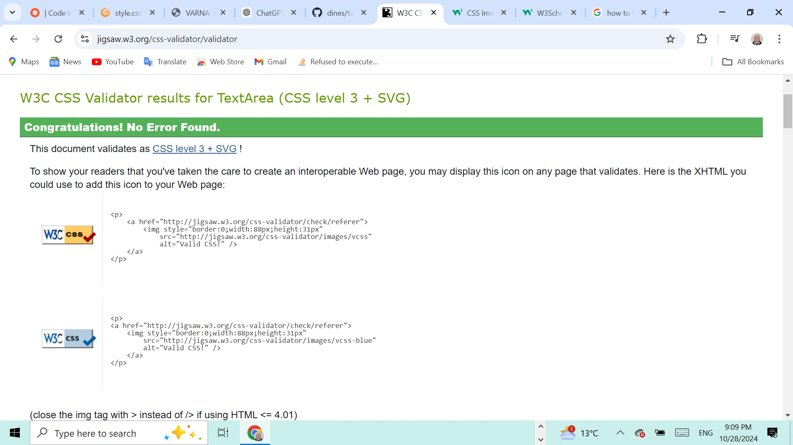

 Javascript validation. The javascript files have been checked on www.jshint.com. 

 

 Javascript validation

---
Form submission validation. Form submission using Javascript.

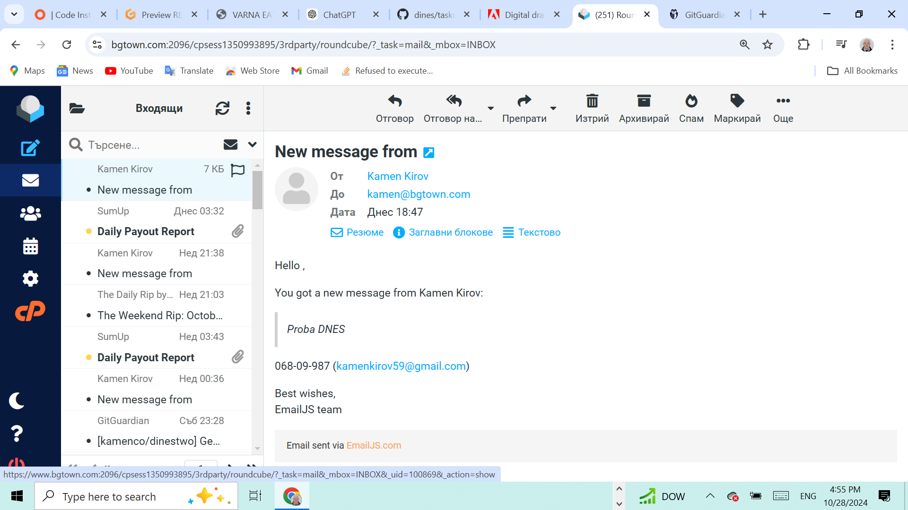
Validation from emaijs.com

 Python validation

Python is validated on CI Python linter The HTML and CSS coding was tested on https://validator.w3.org
 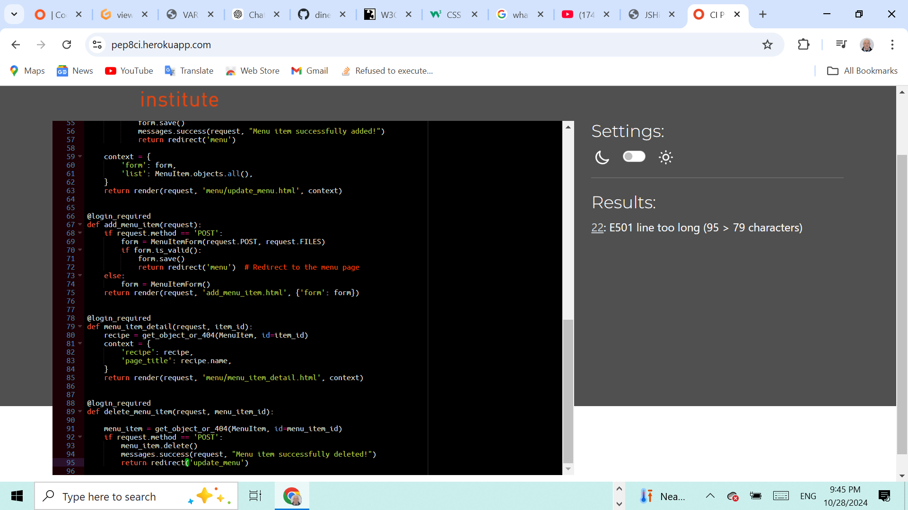
 
---

The page is tested on different browsers Chrome, Firefox, Safari, Opera. The page is responsive and contains all the functions accross differenr screens and sizes. The accessibility testing.
For testing accesibility and SEO and Best Practices, I used Lighthouse in Dev tools. 
Lighthouse runs an audit of your website and feeds back a set of scores for accessibility, SEO and best practices among others.

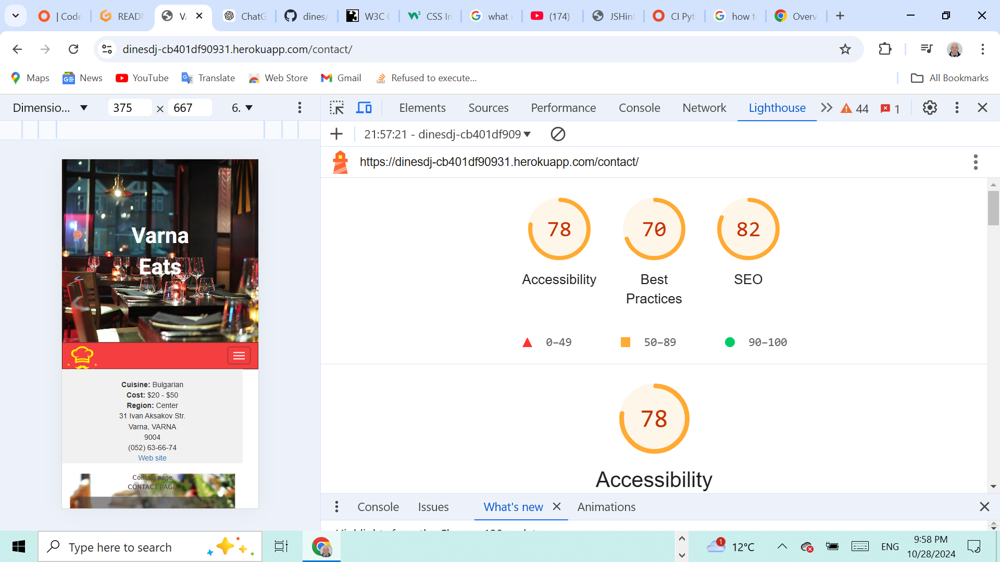

#### Manual Test Cases
#### Navigation Links
Expected:

When a user clicks on a navigation link, it should take them to the correct page without errors.

Testing:
Clicked on each navigation link (Home, About, Contact, etc.) from the navbar and footer.

Result:

Happy Flow: All links worked as expected and navigated to the correct pages. Except contact page.
Exception Flow:
The "Contact" link threw a 404 error due to a missing route in urls.py.
Fix:
Added the missing route for the "About" page in urls.py.

#### Login Form
Expected:
The login form should allow a registered user to log in with valid credentials and display an error message for invalid credentials.

Testing:

Tested with valid credentials:
Username: testuser, Password: testpassword.
Tested with invalid credentials:
Username: wronguser, Password: wrongpassword.
Result:

Happy Flow: The user was logged in successfully and redirected to the dashboard.
Exception Flow:
An error message "Invalid username or password" was displayed for invalid credentials (expected behavior).
Form submission failed if left empty, showing validation errors.
Fix:
No fix required as the validation errors worked correctly.

#### Update menu

Expected: The updte_menu form should update the page with dish's name, recepie, price and image.

Result: The name, recepie and price show correctly.

Exception: The image does not show.

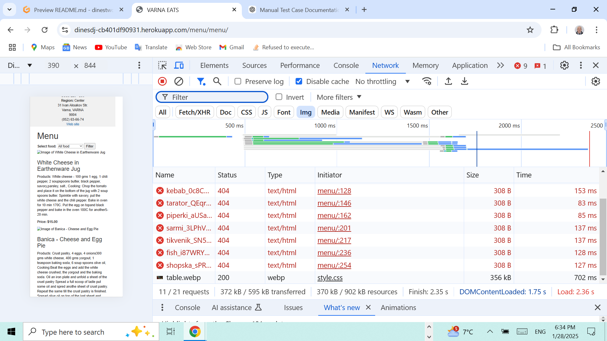

The output in network console shows that instead f the image URL I see 404.html Page Nor Found. Seeing that the cloudinary files exist,  which means the problem is with the database, which has been migrated around the 28th December 2024. The presense of the old images shows it is a database issue. The problem could be solved with an old backup of the database (or a CSV export), to restore the missing data.

#### Filter button on the menu page

Expected:
  To filter the dishes according to their purpose: main course, soup, desserts, all food.

  Result:
  
    Happy flow:
    The filter successfully displays the dishes according to their purpose.

#### Feedback page:

Expected: 
  The user to type his/her feedback, and on submitting the form by the submit button, his/her feedback to be displayed with an option to delete the feedback.

  Result:

    Happy flow:
    The user updates and deletes feedbacks successfully.

#### Tasks page

  Expected:
    The owner(superuser) to add task, to be able to edit and delete the task. The task should be displayed as urgent or non urgent.

  Result:

    Happy flow:
      The owner(superuser) adds, edits, and deletes task successfully.

#### Contact page

  Expected:
    The user should be able to fill the form and make reservtion by sending it to the restaurant manager.

  Result:

    Happy flow:
      The user sends the reservation form successfully.

---

## [Bugs and Issues](#bugs-and-issues)

New bug appeared in the latest version of this site. The images can not be displayed. The problem lis in the database. The old postgresql database was migrated, and it had warnings that have been ignored. This database does not show the images.

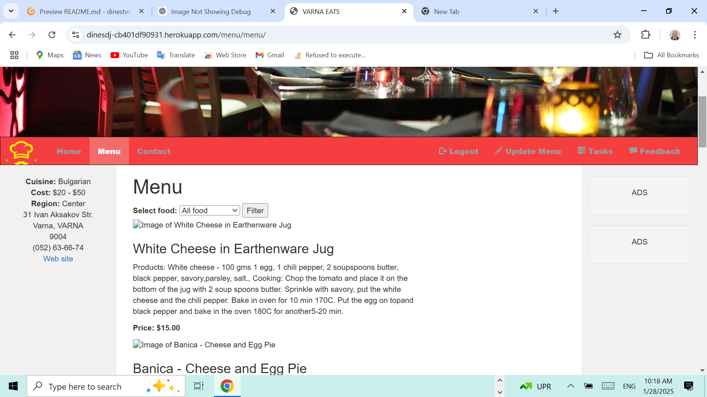

Debugging from the shell Checking if any items have missing image URL.: 

                  from menu.models import MenuItem
                  for item in MenuItem.objects.all():
                  print(item.name, item.image.url if item.image else "No image")

                  This returns:

Additional debugging steps: Verifying Cloudinary storage setup. Checking if the images uploaded from the older version exist:

Seeing that the cloudinary files exist,  which means the problem is with the database, which has been migrated around the 28th December 2024. The presense of the old images shows it is a database issue. The problem could be solved with an old backup of the database (or a CSV export), to restore the missing data.

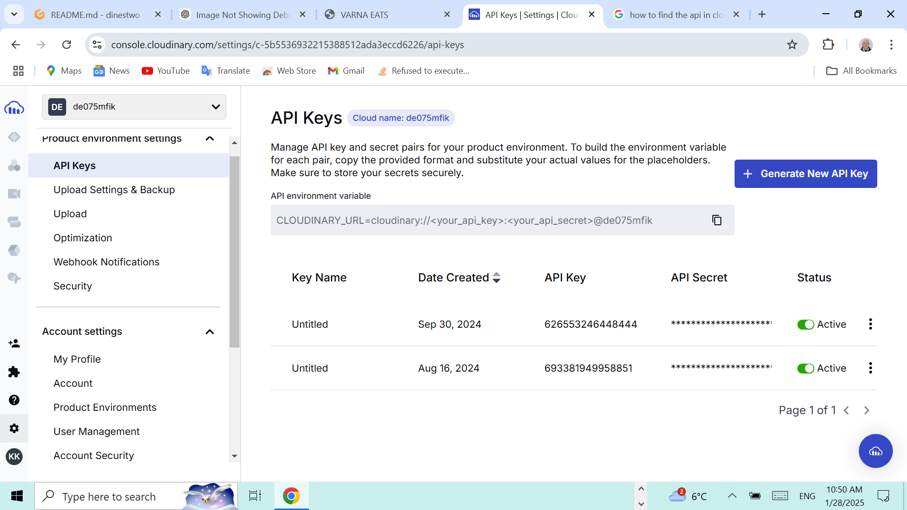

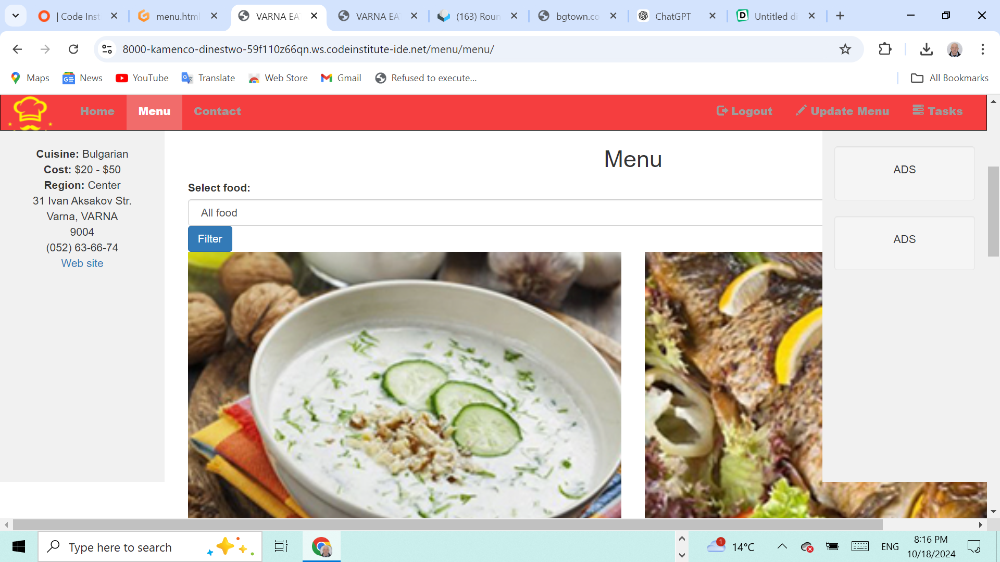

Whe tryed to use bootsrap cards to display the menu items a bug happened, which displayes the original image way too big. The bug was resolved by resorting to plain CSS.

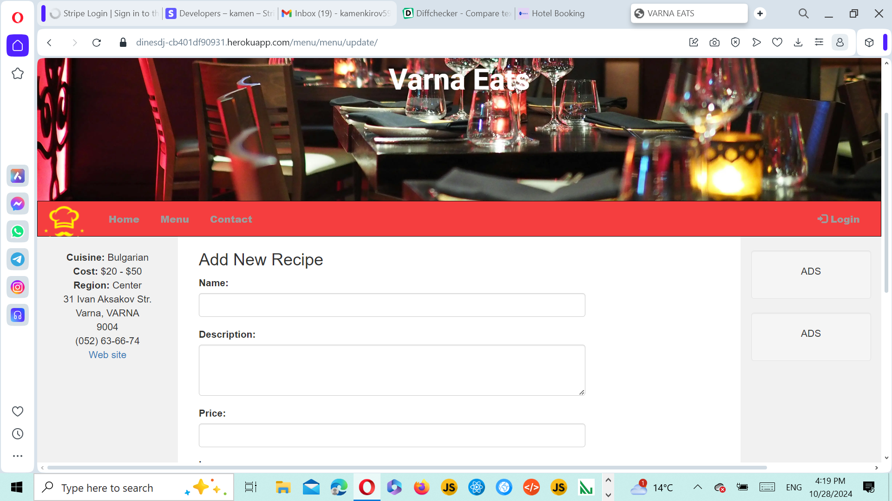

This bug was solved with adding 

        from django.contrib.auth.decorators import login_required

        @login_required
        def delete_menu_item(request, menu_item_id):
    
        menu_item = get_object_or_404(MenuItem, id=menu_item_id)
        if request.method == 'POST':
        menu_item.delete()
        messages.success(request, "Menu item successfully deleted!")
        return redirect('update_menu')

This makes the menu accessible to only logged in users. @login_required enforces authentication.

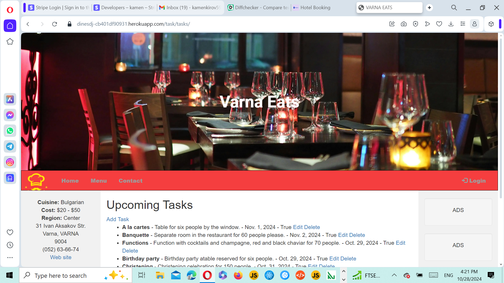

This bug was solved with adding 

        from django.contrib.auth.decorators import login_required

        @login_required
        def edit_task(request, task_id):
        # Only accessible to logged-in users
        task = Task.objects.get(id=task_id)
        # Render edit form and process updates

This makes the menu accessible to only logged in users. @login_required enforces authentication.

This bug appeared because the Pillow has been installed but has not been freezed in the requirements.txt After adding Pillow to the requirements.txt the issue was resolved.

---

## [404.html](#notfound-page)

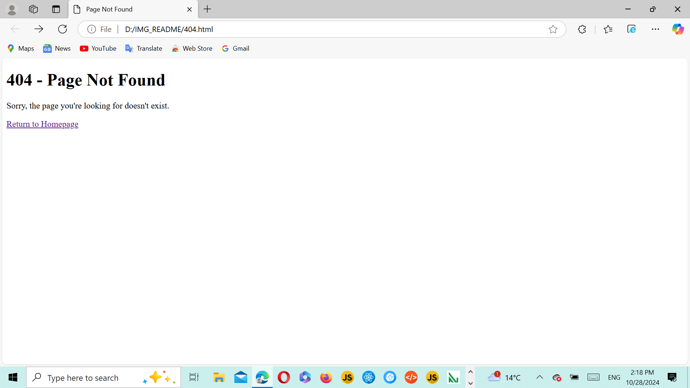

Django configuration to use the Custom 404.html page. In settings.py DEBUG=False in production mode, and ALLOED_HOSTS=['https://dinesdj-cb401df90931.herokuapp.com/', 'localhost']

 - ---

## [Deployment](#deployment)

Cloudinary storing the pictures that are dynamically uploaded by the user.
API_KEY, API_SECRET and CLOUDINARY_NAME  used from cloudinary.com and implemented into the web site.

Heroku deployment
To deploy Your App to Heroku, you have to :

+ Create a Heroku account.
+ From the dashboard select create new app.
+ Enter a name for your app, it needs to be unique, and select your region then press create app.
+ Select settings at the top of your app page.
+ Press reveal config vars.
+ Scroll down and press the add buildpack button.
+ Scroll back up and select Deploy at the top of your app page.
+ Choose your deployment method, when choosing Github, you will have to connect to your account.
+ Then choose which repo you want to deploy and connect to it.
+ Choose if you want to deploy automatic or manual, and press deploy.

**To fork this repository on Github, you have to:**

+ Go to my GitHub repository.
+ In the top-right corner of the page, click Fork.
+ Under "Owner," select the dropdown menu and click an owner for the forked repository.
+ Click Create fork.

**To clone this repository, you have to:**

+ Go to my GitHub repository.
+ Above the list of files, click Code.
+ Copy the URL for the repository.
+ Open Git Bash.
+ Change the current working directory to the location where you want the cloned directory.
+ Type git clone, and then paste the URL you copied earlier.
+ Press Enter to create your local clone.

---

## [Credits](#credits)

 The idea for the bootstrap design was taken from https://www.w3schools.com/.
 
 This site was build with the help of www.chatgpt.com, but most important with the lectures of www.codeinstitute.net and namly the lectures for emailjs.com and the task application.
 
 Pictures recepies and links for the pictures were taken from www.bgtown.com
 
 Some of the styling was made with the help of www.bootstrap.com 
 
 The chef's logo was taken free from https://logo.com/
 
 The photos were taken from www.pexels.com
 
The idea for the site was accepted from the Code Institute reccomendation for project 4. 

This side is used with the help of Codeacademy's course and the help of the tutors and facilitators, and mentors. Special thanks to facilitator Laura for sending me useful links for testing, thanks to my tutor Mr. Medale. Special thanks to all the tutors, I will mention the names of the last two as I can remember only their names Rebecca and Tom, but there were several other tutors that helped a lot.

[Back to top](#wireframe)

